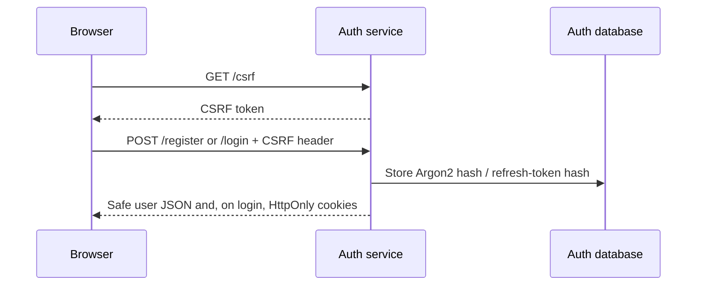
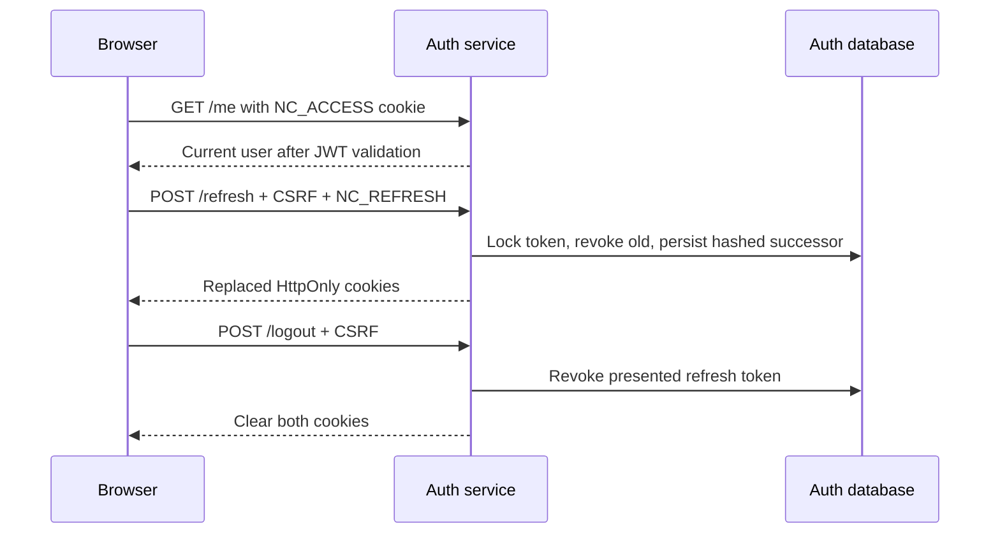

# Authentication Architecture

## Model

The auth service owns identity data in `novacommerce_auth`. Passwords use Argon2id; access tokens are 15-minute RS256 JWTs with issuer, audience, UUID subject, expiry, token ID, and role claims. Refresh tokens are random 256-bit opaque values; only their SHA-256 hashes are stored.

Browser authentication uses HttpOnly `NC_ACCESS` and `NC_REFRESH` cookies. `NC_REFRESH` is restricted to `/api/v1/auth`. Browser mutations require Spring Security CSRF tokens, exposed by `GET /api/v1/auth/csrf`; the frontend keeps only that non-authentication CSRF value in memory. HTTPS and `AUTH_COOKIE_SECURE=true` are mandatory outside local HTTP development.

## Registration and Login

Public registration normalizes email and assigns `CUSTOMER` only. Login returns safe user data but never token values.

## Authenticated Requests, Refresh, and Logout

Refresh rotation is transactional and locks the token row. Reuse of a revoked/rotated token revokes all active tokens in its family and returns a controlled authentication error. This may sign out a legitimate client if a stolen old token is replayed; that trade-off contains credential replay promptly.

## Key Management and Boundaries

RSA keys come from configured PEM paths. The key-generation helper creates local files under ignored `.local/keys/`; automated tests generate an in-memory RSA pair instead. Other services must not query auth tables. They will validate access JWTs through the auth public-key distribution design introduced in a later phase.
