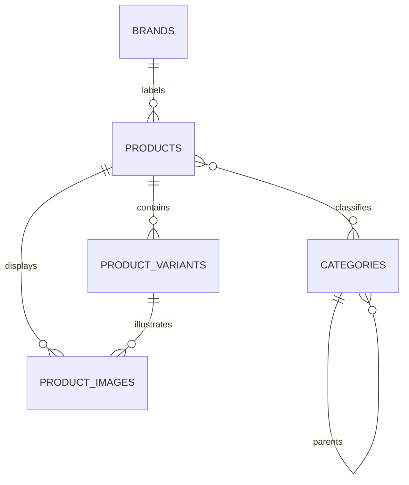

# Catalog & Product Discovery Architecture

## Responsibility

`catalog-service` owns brands, hierarchical categories, products, variants, images, publication state, and product search. It does not own stock, reservations, carts, orders, or payment state. The service owns the `novacommerce_catalog` PostgreSQL database; no other service may read these tables directly.

## Model

Products start as `DRAFT` and become public only after an active variant exists. Variants contain SKU, attributes, price, currency, and active state; inventory is deliberately absent from this model.

## APIs and security

Public read APIs expose active brands, categories, product summaries, product details, filtering, pagination, and search. Admin writes are under `/api/v1/admin/catalog/**`, require an `ADMIN` role from the Auth Service JWT, and use the auth service's published JWKS for signature verification. Catalog validates the signature, expiry, issuer, audience, and `roles` claim locally; it does not call Auth or read the Auth database. Because authentication arrives in an HttpOnly cookie, browser mutations use a double-submit CSRF token. Credentialed CORS is restricted to configured frontend origins. Slugs are normalized before persistence and unique within their owner table.

## Search and cache

PostgreSQL is the source of truth. A generated English `tsvector` and GIN index support full-text search in production; the test profile uses a deterministic `LIKE` fallback. Fixed query fragments are selected from a whitelist while all user values are bound parameters. Product detail reads use cache-aside Redis keys `catalog:product:{slug}` with a bounded TTL. Cache failures fall back to PostgreSQL, and command-side invalidation runs after a successful transaction commit.

## Failure boundaries and deferred work

Catalog remains usable when Redis is unavailable, at the cost of latency. Redis is therefore excluded from the aggregate Actuator health status; PostgreSQL remains a critical health dependency. PostgreSQL outages make catalog reads and writes unavailable and are surfaced through Actuator health. The service does not publish Kafka events yet; outbox, search projections, inventory reservations, and API gateway concerns belong to later phases.
