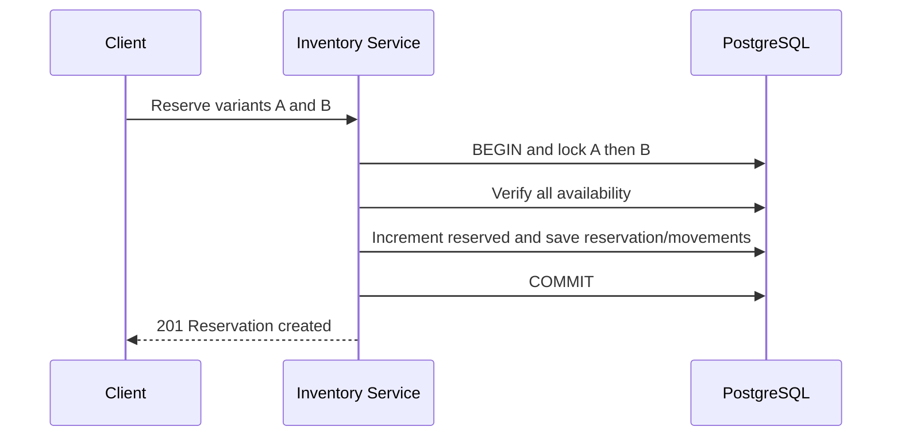
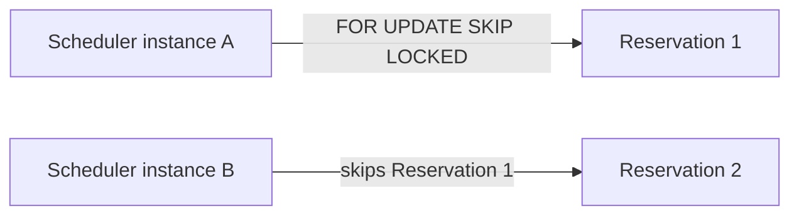

# Inventory and Reservation Service

Inventory owns on-hand and reserved quantities, availability, auditable adjustments, reservations, and expiration. Catalog remains the owner of product and SKU information. Inventory stores only the Catalog `variantId` as an external UUID: no cross-database foreign key and no Catalog database access. Phase 3 deliberately does not synchronously validate every UUID with Catalog.

PostgreSQL is the sole source of truth. Redis inventory locks and cached mutable quantities are intentionally absent. Kafka events and an outbox are deferred until Order consumes inventory events.

## Data model and lifecycle

`inventory_items` stores on-hand and reserved stock; `available = on_hand - reserved` is derived. Database checks enforce `on_hand >= 0`, `reserved >= 0`, and `reserved <= on_hand`. `inventory_reservations` holds a unique idempotency key, canonical request hash, JWT-derived owner, expiry, and the `ACTIVE`, `RELEASED`, `COMMITTED`, or `EXPIRED` state. Positive line quantities live in `inventory_reservation_items`. `inventory_movements` is append-only through the application API.

Release decreases reserved only. Commit decreases on-hand and reserved. Expiration performs the same release under an EXPIRED transition. Repeating the matching terminal operation is safe; incompatible transitions conflict.

## Concurrency and idempotency

Multi-row paths sort UUIDs and acquire PostgreSQL write locks in deterministic order. All items are checked and changed in one transaction, so shortages roll everything back. A five-second PostgreSQL lock timeout prevents indefinite waits; failures become controlled conflicts.

Duplicate variants are rejected. The sorted `variantId:quantity` representation is SHA-256 hashed. A PostgreSQL transaction advisory lock serializes the caller idempotency key before its unique database record is checked. Same key/hash returns the original; same key/different hash returns `IDEMPOTENCY_KEY_REUSED`.

## Expiration worker

The scheduler claims a bounded, indexed batch with `FOR UPDATE SKIP LOCKED`, then locks reservation and sorted inventory rows and releases stock transactionally. Multiple instances skip already claimed work.

## Security, API trade-offs, and failures

Public availability exposes only status and derived available quantity. Reservation ownership comes from JWT `sub`, never browser input. RS256 tokens are locally verified through Auth JWKS for signature, issuer, audience, expiry, and roles. CUSTOMER/ADMIN manage owned reservations; ADMIN alone adjusts/inspects stock and commits. Cookie authentication retains CSRF, and credentialed CORS accepts only configured origins.

PostgreSQL is health-critical. Stable errors hide SQL and locking details. Bulk availability uses bounded POST (100 UUIDs) to avoid URL limits; CSRF still applies because it is an unsafe browser method. Inventory metrics count successful reservations, adjustments, and expirations. Stock movements carry relevant references without logging JWTs.
