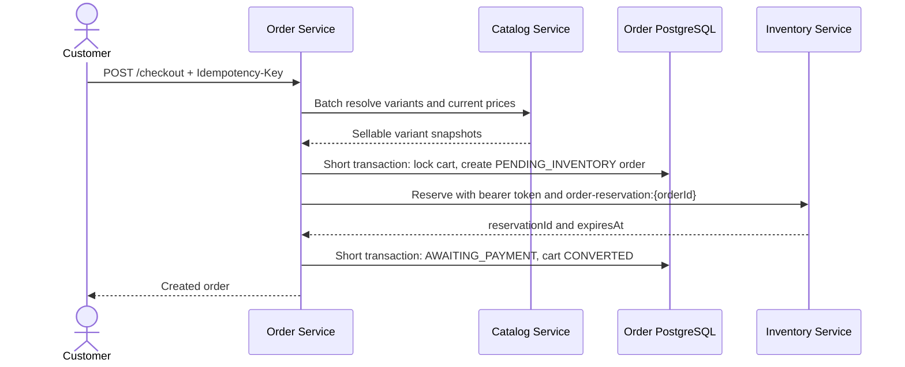
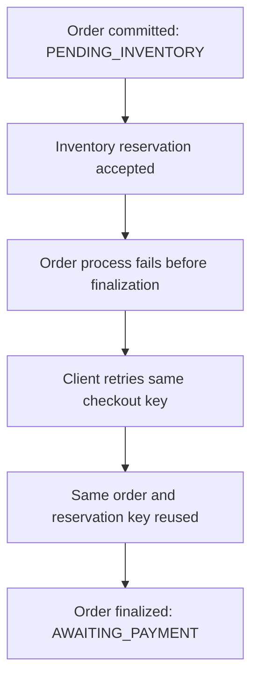

# Cart, Order, and Checkout

## Responsibilities

Order Service owns authenticated carts, immutable order history, checkout idempotency, and coordination with Catalog and Inventory. It owns `novacommerce_order`; it never queries another service's database. Catalog remains authoritative for sellability and price until the order snapshot is created. Inventory remains authoritative for stock and reservation lifecycle.

Adding an existing cart variant increases its quantity. Cart prices are deliberately not stored or accepted at checkout. One `ACTIVE` or `CHECKOUT_PENDING` cart per owner is enforced in PostgreSQL.

## Checkout sequence

No network call is made while a database transaction or cart lock is held. Money uses `BigDecimal` and PostgreSQL `NUMERIC`; historical order items contain immutable product, variant, SKU, attribute, currency, unit-price, and line-total snapshots.

## Idempotency and recovery

The uniqueness key is `(owner_id, checkout_idempotency_key)`. A hash of owner, cart, and sorted variant quantities prevents a key from being reused for different intent. The cart row lock and open-cart constraint prevent two different keys from producing two successful orders for the same cart.

If Inventory times out after accepting a reservation, the order remains `PENDING_INVENTORY` and the cart remains `CHECKOUT_PENDING`. A retry with the same checkout key loads the same order and sends the same deterministic Inventory key. Inventory then returns the existing reservation and Order can finalize safely.

Very old pending orders expire and reopen their carts only after `ORDER_PENDING_CHECKOUT_TIMEOUT`, configured longer than the reservation TTL. This avoids releasing an outcome that is still unknown. `AWAITING_PAYMENT` orders expire when their recorded reservation expiry passes; Inventory independently expires the reservation.

## Cancellation and security

Cancellation is owner/admin only. Order first requests idempotent Inventory release using the caller's bearer token and marks the order `CANCELLED` only after a confirmed response. An unknown release outcome returns a retryable service error without falsely reporting cancellation.

Order validates RS256 JWT issuer, audience, expiry, and roles from the shared public JWKS. Browser authentication remains HttpOnly-cookie based and all unsafe browser requests require CSRF. Order-to-Inventory calls use an explicit `Authorization: Bearer` header; Inventory exempts only this narrow header-authenticated service-call shape from CSRF.

Payment, Kafka events, transactional outbox, tax, shipping, and promotions remain deferred.
