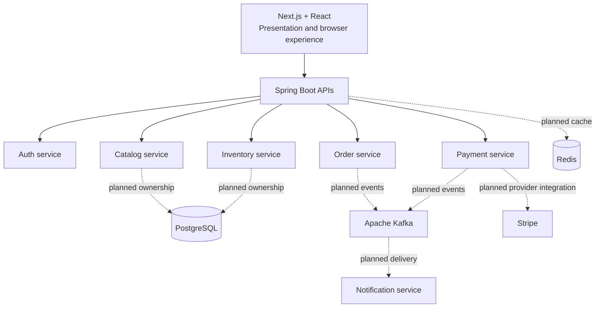

# System Overview

## Responsibilities

The Next.js application owns presentation, navigation, and browser-facing state. It is not the commerce business backend. Spring Boot services will own APIs, validation, business rules, and their own operational concerns.

The proposed services are Auth (identity), Catalog (merchandising), Inventory (availability), Order (order lifecycle), Payment (payment coordination), and Notification (communications). These are boundaries for future implementation, not implemented capabilities.

## Data and Communication

Each service will own its data and migrations. A service must not query another service's database; synchronous calls will be used only when an immediate response is required. Kafka is planned for durable domain-event propagation and workflows that can complete asynchronously. Redis is planned for narrowly justified cache, rate-limit, or ephemeral coordination use cases, never as the system of record.

## Failure Boundaries

Service failures, unavailable downstream dependencies, and delayed events are expected independent failure domains. Future workflows must define timeouts, retries, idempotency, and reconciliation where needed. Phase 0 deliberately adds none of those mechanisms before there are concrete workflows to protect.

## Why This Starts Small

Six high-level boundaries are enough to make ownership visible without creating dozens of operational units. Services remain independently deployable, but the platform will only split a boundary further when a real domain, scaling, reliability, or ownership need supports it.

