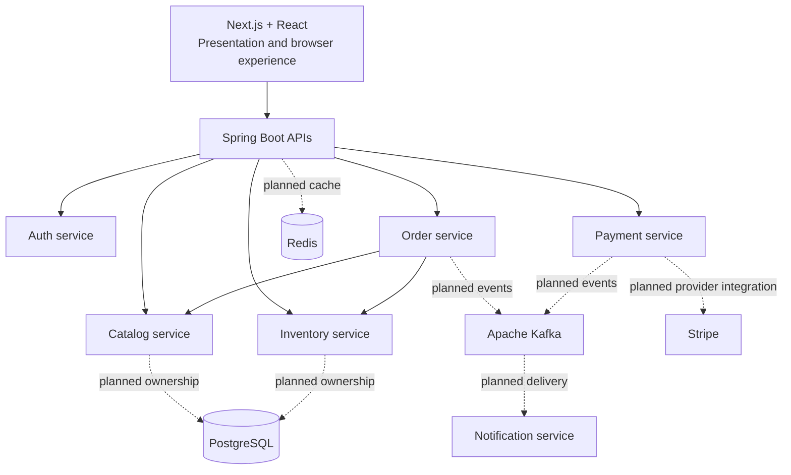

# System Overview

## Responsibilities

The Next.js application owns presentation, navigation, and browser-facing state. It is not the commerce business backend. Spring Boot services will own APIs, validation, business rules, and their own operational concerns.

The service boundaries are Auth (identity), Catalog (merchandising), Inventory (availability), Order (cart and order lifecycle), Payment (payment coordination), and Notification (communications). Auth, Catalog, Inventory, and Order are implemented foundations; Payment and Notification remain planned.

## Data and Communication

Each stateful service owns its data and migrations. A service must not query another service's database. Checkout synchronously resolves Catalog prices and reserves Inventory because the caller needs an immediate outcome; idempotency and reconciliation cover unknown results. Kafka remains planned for durable domain-event propagation. Redis is used only for justified cache-aside Catalog reads and is never the system of record.

## Failure Boundaries

Service failures and unavailable downstream dependencies are independent failure domains. Checkout uses short local transactions, stable keys, explicit pending states, safe retries, and bounded reconciliation. Payment failure handling and asynchronous delivery guarantees remain deferred until those workflows exist.

## Why This Starts Small

Six high-level boundaries are enough to make ownership visible without creating dozens of operational units. Services remain independently deployable, but the platform will only split a boundary further when a real domain, scaling, reliability, or ownership need supports it.

